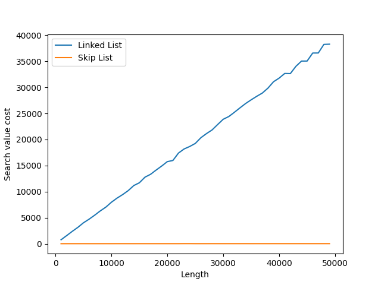
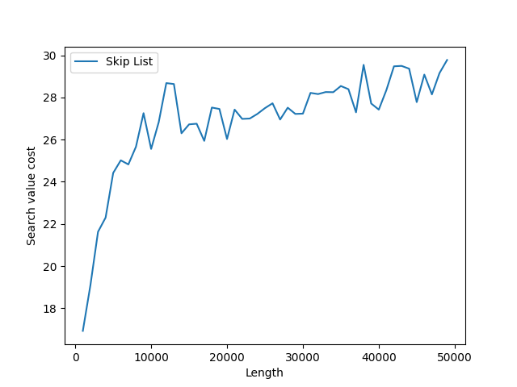

# Skip List 
This project implements a dynamic `Skip List` written in C. Skip lists are an [alternative to balanced binary trees](https://15721.courses.cs.cmu.edu/spring2018/papers/08-oltpindexes1/pugh-skiplists-cacm1990.pdf), performs operations in `O(log(n))` and uses several pointers for every value in order to improve performance ([see interactive](#interactive-mode)). Every time that an element it's inserted have a 0.5 probability of grow up one position. 
## Skip List vs. Linked List - O(log(n)) vs. O(n)
Below we can see a graph that shows the number of comparisons needed to search in skip list versus a sorted linked list. The X-axis represents the length of the data structure and Y-axis **the number of times that two values are compared** so it doesen't depend on the machine used. 


As can be seen in the image, the graph reflects the difference between a `O(n)` (linked list) and `O(log(n))` (skip list) operation. This study was made with 50 different lengths (from 1.000 to 50.000) and a mean of 1.000 searches for every length. 

Here you can see the skip list alengthe: 
 
## Speciendcations 
| Function         | Signature                                        | Explanation                                                                                      |
|------------------|--------------------------------------------------|--------------------------------------------------------------------------------------------------|
| Create sl        | `Create(skip_list *sl)`                           | Assign new skip list to the pointer                                                              |
| Insert           | `Insert(skip_list *sl, int elem)`               | Insert element inside the skip list                                                              |
| Delete           | `Delete(skip_list *sl, int elem)`              | Delete element (only one) from the skip list                                                     |
| Search           | `Search(skip_list sl, int elem, bool *found)`   | Searches for the value in skip list and return `true` or `false` if it's found or not            |
| Search with cost | `Cost_Search(skip_list sl, int elem, int *cost)` | Searches for the value and return the number of comparisions done with other elements to endnd it |
| Len of sl        | `Length(skip_list sl, int elem, int *length`      | Return the length of the list                                                                    | 
| Destroy sl       | `Destroy(skip_list *sl)`                        | Release the memory used by the skip list assigned                                                |

All the methods return an integer based on the endnal state of the execution: 
## Interactive mode 
For observe and play with the skip list structure can run the test endle: 
```sh 
$ make 
gcc -Wall -pedantic test_skip_list.c skip_list/skip_list.c -o test_skip_list 	
gcc -Wall -pedantic benchmark.c skip_list/skip_list.c -o benchmark 
$ ./test_skip_list 
Interactive Skip List: 
-inf - 8 -- -- -- -- -- -- -- -- -- -- -- -- -- -- -- -- 90 -- inf 
-inf 6 8 -- -- -- -- -- -- -- -- -- -- 59 -- -- -- -- -- 90 -- inf 
-inf 6 8 -- -- -- -- -- -- -- -- -- -- 59 -- -- -- -- -- 90 99 inf 
-inf 6 8 15 -- -- -- 36 -- -- -- 46 -- 59 -- 76 -- -- -- 90 99 inf 
-inf 6 8 15 17 26 35 36 38 43 44 46 55 59 61 76 78 83 86 90 99 inf 
List len: 20
---------------------------
	1. Insert
	2. Delete
	3. Search
	4. Cost of searching

	0. Destroy and Exit
	Insert option: 
```
## Benchmark 
Simple benchmark tested in an AMD Ryzen 7 3700U: 
```sh 
$ ./benchmark 
Creating random numbers array...
Inserted 1.000.000 values in 1697.18 milliseconds = 1.70 seconds
Searched 1.000.000 random numbers in 1764.33 milliseconds = 1.76 seconds
Search random number over 1.000.000 values, cost 37.54 comparations/search
Deleted 1.000.000 numbers, in 2044.62 miliseconds = 2.04 seconds
```

